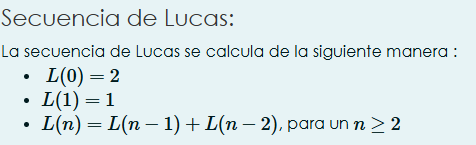
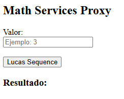
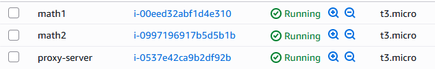
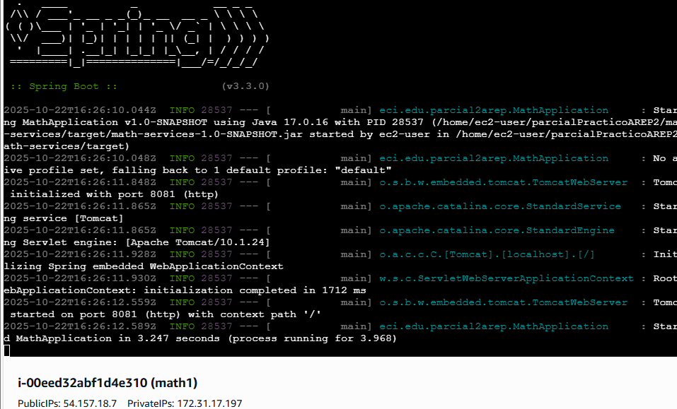
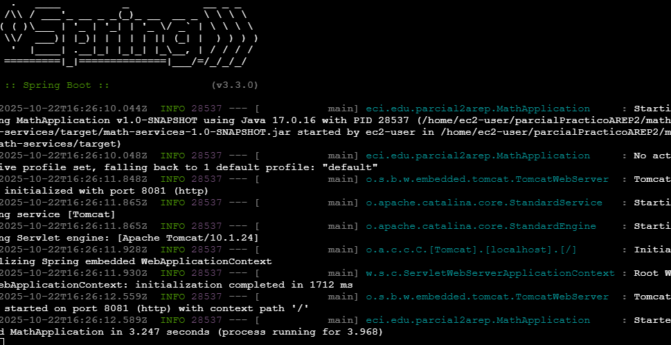

# Parcial practico segundo corte


## Arquitectura


## Run
Comando para ejecutar el proxy server, ya que se hizo unsa modularizacion en el proyecto donde:

* parcial2Arep = Proyecto padre

* math-services = modulo hijo

* proxy-server = modulo hijo

### Proxy Server

```
mvn clean package
cd proxy-server
cd target
java -jar proxy-server-1.0-SNAPSHOT.jar
```

### Math-services Server

```
mvn clean package
cd math-services
cd target
java -jar math-services-1.0-SNAPSHOT.jar
```

## Problema matematico de math service



## Cliente 


## instancias creadas


## instancias corriendo

### math-serice 1



### math-serice 2

